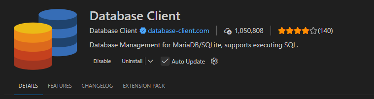
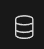

# PirateShield

## Getting Started

### Prerequisites
- Node.js (v18 or higher)
- Python 3

### Installation

1. Download Node.js

https://nodejs.org/en


2. Make sure you have a working version
```
npm -v
```
```
node -v
```

3. Clone the repository and navigate to the project folder:
```bash
cd pirateshield
```

4. Install dependencies:
```bash
npm install
```

### Running the Project

To start the development server:
```bash
npm run dev
```

This will:
1. Generate synthetic network events using the Python script
2. Start the local server at `http://localhost:3000`

### Viewing the Data

Open your browser and go to:
```
http://localhost:3000
```

Install the following extension:


Click this in order to set and connect to:
```
pirateshield.db
```
