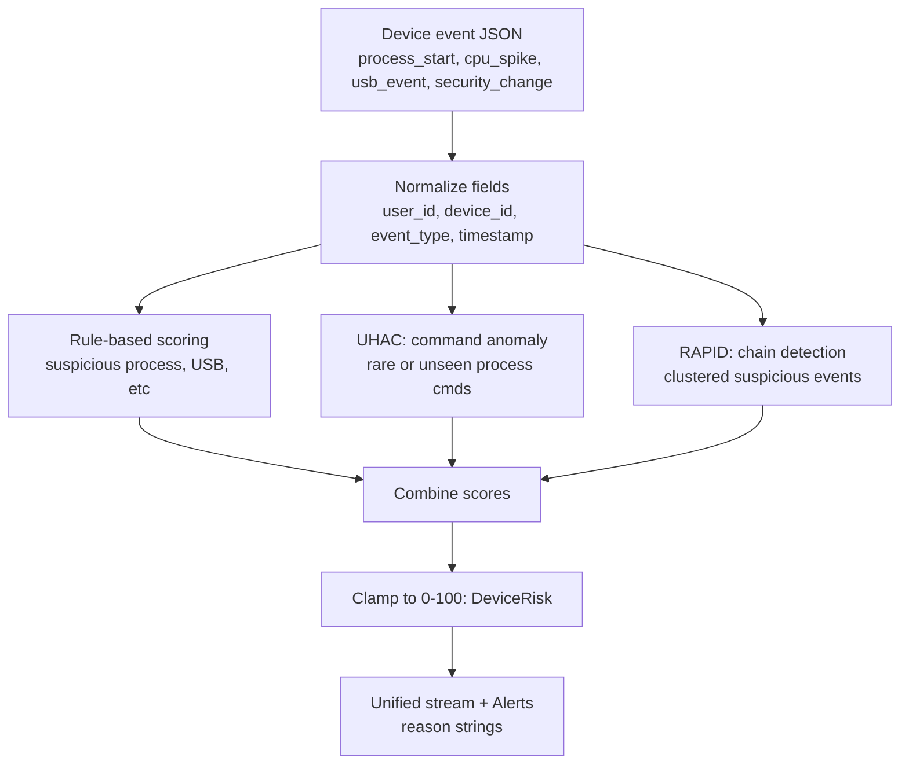

# Problem Statement & Structure (Endpoints / Devices)

## Core Problem (K–12 endpoints)
K–12 schools depend on student devices (Chromebooks, Windows laptops, shared lab PCs). These endpoints generate constant activity:
processes starting, CPU spikes, USB insertions, and security setting changes.

Students can misuse endpoints to bypass rules (VPNs/tunneling tools, proxy tools, "bypass" utilities), or an attacker can compromise a device and behave in subtle steps.

The problem: device activity is high-volume and noisy. PirateShield needs a way to turn raw device events into an explainable 0–100 risk score without drowning admins in false alarms.

## Why endpoint detection is hard

1. **High noise / normal variability**  
   Lots of legitimate background processes look "weird" if you only use simple thresholds.

2. **Anomaly ≠ malicious**  
   Something unusual is often just "different," not a confirmed threat. We should treat anomaly scores as prioritization signals, not automatic guilt.

3. **Multi-step behavior is the real threat**  
   Single events can look harmless, but chains are suspicious (process → USB → security disabled → outbound traffic).

4. **Behavior changes over time**  
   Different classes, schedules, and software updates mean "normal" activity on a school device shifts constantly. This is part of why a purely static rule set has limits (and why I suggest a solution).

---

## Endpoint signals (PirateShield device events)
These map to the current repo fields when available.

**Currently supported:**
- `event_type`
- `device_id`, `user_id`, `timestamp`
- `process_name`, `process_path`, `suspicious`
- `cpu_percent`, `baseline_cpu`, `duration_seconds`
- `usb_id`, `usb_action`, `new_executable_started`, `exe_path`
- `component`, `new_status` (e.g., security_change)

**Planned / future fields:**
- `cmdline` (full command line)
- memory (`mem_percent`, `baseline_mem`, duration)
- device switching (`previous_device_id`, `new_device_id`, `switch_gap_minutes`)

---

# Device risk scoring structure (WIP)

## Goal
Produce a simple, explainable `DeviceRisk` score (0-100) primarily from rule-based signals, while drawing inspiration from research on anomaly detection and behavior chains.

1. Rule-based scoring of suspicious endpoint activity
2. A UHAC-inspired idea for detecting unusual process behavior
3. A RAPID-inspired idea for identifying suspicious sequences of events

## Scoring weights (intended design)
Rule-based scoring is intentionally the heaviest driver, it produces the most points and is the most explainable (you can always point to exactly why the score is high). The UHAC and RAPID layers act as small confidence nudges on top, capped at +20 and +15 respectively, so that a concrete rule trigger like "firewall disabled" always outweighs a borderline anomaly signal on its own.

| Layer | Role | Max contribution |
|---|---|---|
| Rule-based scoring | Main driver | ~160 before clamp |
| UHAC: command anomaly | Small nudge for unusual commands | +20 |
| RAPID: chain detection | Small nudge for clustered events | +15 |

---

### Mermaid overview (how scoring fits into PirateShield)

---

## Worked Example

This example shows a borderline case where base rules alone would not trigger a high alert, but the UHAC and RAPID layers push it over the threshold, demonstrating why those layers matter.

A student on `lab-01` triggers three events within 10 minutes:

| Event | What happened |
|---|---|
| `process_start` | Unknown process launched - not on any known suspicious list |
| `process_start` | A second unfamiliar process starts shortly after |
| `cpu_spike` | Brief CPU spike, just above baseline but not sustained |

**Rule-based scoring:**

| Rule triggered | Points |
|---|---|
| Brief CPU spike (above threshold, not sustained) | +10 |
| **Base total** | **10** |

Base rules alone: score of **10** — below every alert threshold, nothing happens.

**UHAC layer** *(illustrative)*: both process commands look highly unusual compared to normal activity → +18  
**RAPID layer** *(illustrative)*: 3 suspicious events clustered in 10 min window → +10  

**Final:** `clamp(10 + 18 + 10, 0, 100)` = **38 (Medium alert)**

**Why this matters:** Pure rule-based scoring would have ignored this entirely. The UHAC layer flagged that the command text was unlike anything seen before, and the RAPID layer recognized the pattern of multiple odd events in a short window. Together they surfaced something worth a human looking at.

**Alert reason string:**
> Brief CPU spike · Unusual process commands detected · Multiple suspicious events in short window

---

## Sources

- **UHAC**: Kayhan, V.O., Agrawal, M., & Shivendu, S. (2023). *Cyber threat detection: Unsupervised hunting of anomalous commands.* Decision Support Systems, 168, 113928.
- **RAPID**: Amaru, Y., Wudali, P.N., Elovici, Y., & Shabtai, A. (2025). *RAPID: Robust APT detection and investigation using context-aware deep learning.* Computer Networks, 273, 111744.
