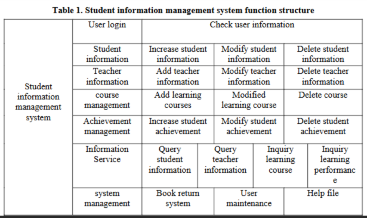

# Access, Permissions, and Data Misuse Draft

---

## Sensitive School Systems

- Ellucian Banner  
- OneDrive  
- Canvas  
- Google Classroom  

---

## Role-Based Access Expectations

User Login → Access to all functions aligned with assigned role.

### System Modules Overview

**1. Basic Student Information Management**
- Student name
- Age
- Home address
- Family contact number
- Parent names
- Parent employment status

**2. Student Course Management**
- Add / delete / modify / view course information
- Teacher assignment information
- Real-time student course lookup

**3. Comprehensive Evaluation Management**
- Student ideological/moral evaluation
- Academic performance
- Other quality metrics
- Students may only view their own evaluation
- Counselors, department leaders, student management personnel, and DB admins can edit
- Teachers may view only

**4. Tuition Management**
- Tuition billing information
- Payment records

---

# Common Access Misuse Scenarios in Schools

- LMS platforms sharing raw student activity data (login times, assignment submissions, page clicks) with instructors without explicit student consent.
- Lack of clear educational purpose for certain data sharing.
- Immediate marginalizing effects due to direct student monitoring.
- Large-scale data aggregation risks for analytics misuse.

---

# Access and Permission Anomaly Rules

## Mitigating Privilege Misuse

When monitoring privilege misuse, consider:

1. The system/service being monitored (SIS, LMS, HR, Tuition, etc.)
2. Existing roles:
   - Students
   - Parents
   - Teachers/Staff
   - IT
   - Principal
3. Expected behaviors for each role.

---

## Expected Role Behaviors

### Student
- Access to course information
- Personal account management (password changes)
- Email access (high school level)

### Parent
- Access to student course information
- Account password management
- Student medical/contact info
- Email access

### Teacher/Staff
- Access to course information
- Account password management
- Limited student personal info (contact info only)
- Access to students within assigned courses
- Email access

### IT
- Access to system metadata (not personal student data)
- Password resets
- Login statistics
- Network traffic logs
- Global announcements

### Principal
- Staff contact information
- Global announcements
- Email services
- Student course information (school-wide)
- Disciplinary records

---

# Access-Related Alerts

### 1. Access Failure – Insufficient Privileges
User attempted to access information outside their assigned role permissions.

### 2. Bulk Data Download Detected
Large volume of data downloaded in a short time period.

### 3. After-Hours Access Detected
User accessed system outside normal school hours.

---

# Access-Related Event Fields

Each access log entry should include:

- UserID / Email
- Role (Student, Teacher, etc.)
- Timestamp
- Source IP Address
- Device ID
- Resource Accessed (Student record, payroll file, course page, etc.)
- Action Type (View, Edit, Download, Delete)
- Record Count (number of records affected)
- Data Size (download size)
- Login Status (Success / Failure)
- Geolocation
- MFA Used? (Yes/No)
- VPN Used? (Yes/No)
