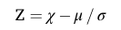
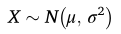
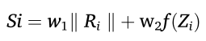
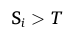
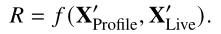
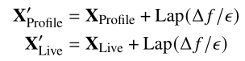

# Anomaly Detection in Heterogeneous Cybersecurity Data

## Method 1: The Z-Score Baseline Detection Function

Where x is current login event value, μ is the student's historical mean from the 30-day baseline, and σ is the standard deviation of that baseline. A threshold is then applied - the paper suggests |Z| > 3 as a standard cutoff, though the paper also notes this can be changed accordingly. 

For PirateShield, we can apply this independently to each signal. 
- For login time, x is the hour/time of the current login, μ is the student's average login hour over 30 days, and σ is how much their login times typically vary. 
- For login frequency, x is how many times the student has logged in today, μ is their average daily login count, and σ is the standard deviation of their daily count.

We get a separate Z-score for each feature, which we then combine using Method 3.

## Method 2: The Gaussian Baseline Distribution Model

This is the mathematical justification for the 30-day window approach. We are not just storing averages arbitrarily - you're fitting each student's login behavior to a Gaussian distribution defined by its mean and variance. This gives us a citable theoretical basis for why 30 days of data is meaningful: it's enough observations to estimate μ and σ reliably for a distribution that the paper formally establishes as the correct model for normal behavioral data.

A practical implication for PirateShield: if a student's login times have a very high σ (they log in at a wildly varying time), the Z-score for any given login will naturally be lower, meaning irregular students won't be over-flagged. If a student logs in at 8am and σ is near zero, even a small deviation will produce a large Z-score. The model self-calibrates per student automatically. 

## Method 3: The Hybrid Weighted Anomaly Score

Perhaps the most important contribution for PirateShield's multi-signal scoring. After computing individual Z-scores per feature, the paper defines a final composite anomaly score:

Where w₁ and w₂ are weights balancing statistical and ML components, Rᵢ is the statistical residual (deviation from baseline), and f(Zᵢ) is an additional scoring function. Classification as anomalous then follows a simple threshold rule:

For PirateShield, we simplify the ML component out entirely since we are not running autoencoders, and expand the statistical component into multiple weighted signals. 

**S = w₁Z_time + w₂Z_frequency + w₃Z_offhours + w₄Z_weekend**

Each w represents how much that signal should contribute to the final risk score. Off-hours logins might carry higher weight (w₃ = 0.35) than frequency deviations (w₂ = 0.20) because they're a stronger indicator of compromise in a K-12 context. The paper directly validates this weighted additive structure as academically sound practice. 

## Method 4: The Three Anomaly Type Taxonomy

The paper formally classifies anomalies into three types, and this taxonomy is critical for describing what PirateShield detects in our methodology section:
- Point Anomalies — a single login event that deviates significantly on its own, such as a student logging in 47 times in one day when their average is 3
- Contextual Anomalies — a login that is only anomalous given context, such as a login at 2am which is unusual for that specific student even though 2am logins exist in the broader dataset
- Collective Anomalies — a pattern that is anomalous as a group even if individual events look normal, such as a student logging in every hour on the hour for 12 consecutive hours when they typically only log in twice a day

PirateShield is specifically designed to detect contextual anomalies — this taxonomy gives us the precise academic language to make that claim. The paper's own example of "high data transfer during off-hours" directly parallels our "login during off-hours" signal.

## Method 5: The User Behavior Analytics Signal Justification (Table 1)

The paper's Table 1 explicitly lists the following under User Behaviour Analytics (UBA) as both metrics and anomaly indicators:

- Frequency of logins per day
- Login location via geolocation-based anomaly detection
- Multi-factor authentication success/failure rates
- Sudden increase in data access → anomaly indicator
- Unusual working hours access → anomaly indicator

The last two are the most important for PirateShield. The paper formally establishes that unusual working hours access and sudden increases in login frequency are recognized, academically documented anomaly indicators in the UBA literature.

## Method 6: The IQR-Based Threshold Setting

In section 3.6 the paper offers an alternative to hard z-score thresholds for setting anomaly cutoffs:
**Set threshold at 1.5 × IQR (interquartile range)**

This is worth noting for PirateShield as a fallback for students with skewed or non-Gaussian login distributions. Some students may log in very rarely with occasional bursts — their login frequency data won't be normally distributed, making Z-score thresholds unreliable. For those students, using 1.5× IQR as the anomaly boundary is more robust. The paper validates both approaches, giving flexibility to apply z-score for most students and IQR for edge cases, with academic justification for both choices.

## Method 7: The Optimization Objective for Threshold Tuning

The paper defines the formal optimization problem for setting our detection threshold T:

Where TPR is the true positive rate (catching actual compromised accounts) and FPR is the false positive rate (flagging innocent students). The weights w₁ and w₂ represent how much we care about each. In a K-12 context we likely want to weight FPR reduction more heavily than in, say, banking fraud detection — over-flagging innocent students creates IT workload and erodes trust in the system. This formula gives us a principled, citable way to justify whatever threshold T we land on: we're optimizing a formal objective function, not guessing.

# Privacy-Enhanced Adaptive Authentication

## Method 1: The Two-Vector Feature Comparison Model

The paper's core scoring structure compares two feature vectors against each other:
- **XProfile** = the stored historical baseline (your 30-day window)
- **XLive** = the live features at the current login attempt

The risk score is then computed as:

For PirateShield, we map this directly as follows:
- XProfile contains each student's historical means and standard deviations — average login hour, average logins per day, weekend login frequency, off-hours login rate — all calculated from the past 30 days. 
- XLive contains the current session's values — what time they're logging in right now, from what day, whether it's during school hours. 
- The function f computes how far the live values deviate from the stored profile. 

This is essentially a formalized justification for PirateShield's entire baseline comparison approach, with academic backing.

## Method 2: The Five-Category Feature Taxonomy

The paper formally classifies Risk Based Authentication (RBA) features into five categories. This is directly usable in PirateShield's methodology section to position your signals:
- Knowledge-based — passwords, PINs (not used by PirateShield)
- Biometric — fingerprints, facial recognition (not used)
- Behavioral — typing patterns, session frequency, navigation flow
- Contextual — geolocation, device type, time of access
- Interaction-based — session frequency, navigation flow

PirateShield's signals fall cleanly into two categories. Login time and off-hours flag are contextual features. Login frequency and weekday/weekend pattern are behavioral features. Citing this taxonomy lets us formally describe PirateShield's design as a behavioral-contextual RBA system without having to invent that framing ourselves.

## Method 3: Tiered Risk Output with Adaptive Authentication Response

The paper defines three authentication tiers based on the computed risk score R:
- Low risk → Simple authentication (standard login proceeds)
- Medium risk → More steps (additional verification)
- High risk → Advanced authentication (block or escalate)

For PirateShield this maps onto our three-tier alert system. We can cite this structure as the academic basis for our tiered response design rather than presenting it as an arbitrary choice. The paper validates that this low/medium/high risk-to-action mapping is standard practice in RBA systems.

## Method 4: The Laplace Noise Mechanism as a Threshold Smoothing Concept

The paper uses the Laplace mechanism to add calibrated noise to feature vectors before risk scoring:

PirateShield doesn't need differential privacy infrastructure — we're not transmitting sensitive data to an external server. However, the underlying mathematical idea is useful in a different way. The sensitivity parameter Δf in the Laplace formula quantifies the maximum possible change in the risk score when a single feature value changes. We can borrow this concept to define per-feature sensitivity weights in PirateShield's scoring formula — how much should the risk score change if a student's login time deviates by one standard deviation versus if their login frequency doubles? Δf gives us a principled, citable way to justify those weights rather than choosing them arbitrarily.

## Method 5: The Cold-Start Handling Approach

The paper acknowledges cold-start as a known challenge — when a user has no login history, device-centric approaches "require extensive data collection, particularly during the cold-start phase." While the paper doesn't fully solve it, it establishes that cold-start is a recognized problem in the RBA literature. For PirateShield we can cite this acknowledgment to justify our design decision to require a minimum 30-day baseline before anomaly scoring begins, rather than flagging every new student account as high risk by default.

# Policy-driven contextual risk evaluation in OAuth 2.0 authentication frameworks for AI chatbot-based RPA systems