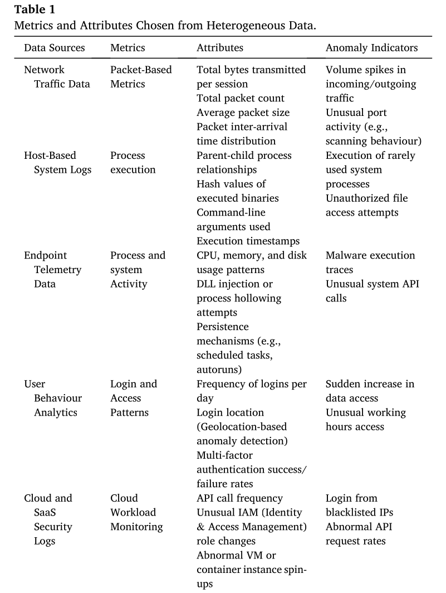
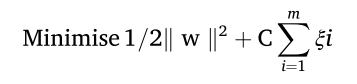
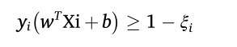
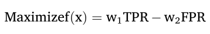
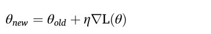

# What and How: Approaches to Contextual Risk Score Modeling for User and Identity Behavior

## Overview

The research papers will go over of how for the methods of contextual risk scoring, explaining the strengths and limitations for PirateShield.

## Approach 1 From: Yun, T. & Min, M. (2025). MITRE ATT&CK-Driven Threat Analysis for Edge-IoT Environment and a Quantitative Risk Scoring Model. Computer Modeling in Engineering & Sciences, 145(2).

**What It Does** 
Provides a lightweight, quantitative risk scoring model that ranks cyberattack types by overall risk using four independently measured factors, enabling prioritization of threats without expensive commercial tools.

**How It Works** 
Combines four weighted components into a single additive formula: **RiskScore = MIS × 0.35 + FS × 0.30 + DS × 0.25 + DifS × 0.10**
    • MIS (MITRE Impact Score): CVSS v3.1 severity scores normalized to 0–1 
    • FS (Frequency Score): Attack prevalence in network data, normalized using Laplace smoothing and log transformation 
    • DS (Detection Score): Computed as 1 − recall from a DNN classifier; higher score = harder to detect 
    • DifS (Difficulty Score): Nonlinear score based on how many Cyber Kill Chain stages an attack traverses 

**Strengths**
    • Additive structure is simple, explainable, and doesn't require expensive infrastructure 
    • CVSS-based impact scoring is free via NIST's National Vulnerability Database 
    • The four-component framework is flexible and could be adapted with K-12-specific inputs 
    • Robustness validation via Spearman's and Kendall's correlation adds academic credibility 

**Limitations**
    • Built for Edge-IoT/IIoT environments, not K-12 education networks — frequency and severity weights won't transfer directly 
    • The DNN-based Detection Score requires ML expertise and computational resources that under-resourced districts don't have 
    • Frequency Score requires structured, labeled network traffic logs that many school districts lack 
    • Produces a static risk ranking, not real-time monitoring — doesn't track live traffic in and out of the network

## Approach 2 From: Anomaly detection in heterogeneous cybersecurity data by S.A. Okolie, C.A. Amadi, J.N. Odii, E.C. Nwokorie, U․C Onyemauche (2025)

**What It Does**
Anomaly detection, which does the process of specifically identifying data points, patterns, or behaviors that deviate significantly from the norm using a dataset. These deviations, or anomalies can signify errors, inefficiencies, or potential threats. It goes over many types of data sources, including network traffic, system logs, user behavior, and endpoint telemetry (we'll just stick with user behavior for this context).

**How It Works**
Uses a standard and hybrid approach for anomaly detection. The standard anomaly detections contains statistical methods, machine learning-based methods, density-based methods, and deep learning-based methods used on a single data point to classify whether it is anomalous or not. 

### Standard Approach
1. Statistical methods
    - **Deviation from Normal Distribution:** "A data point is considered anomalous if its probability under a fitted distribution is below a threshold. An example is the Z-score method, Z = χ − μ/σ, such that "If ∣Z∣ exceeds a threshold (e.g., 5 in a normal distribution), the point is considered anomalous.
    - **Chi-Square Test:** "Used to detect anomalies in categorical data by comparing observed vs. expected distributions."
2. Machine learning-based methods 
    - **Isolation Forest:** "Measures how easily a data point can be "isolated" in a decision tree. A shorter average isolation path length indicates an anomaly."
    - **One-Class Support Vector Machine (SVM):** "Trains a model on normal data and classifies points based on whether they fall inside or outside the learned boundary."
3. Density-based methods
    - **Gaussian Mixture Models (GMM):** "A data point is anomalous if its probability under the mixture model is below a threshold."
    - **DBSCAN (Density-Based Spatial Clustering of Applications with Noise):** "Points in low-density regions are labelled as outliers."
4. Deep learning-based methods
    - **Autoencoders:** "Measures reconstruction error. If the reconstruction error is high, the data point is anomalous."
    - **Generative Adversarial Networks (GANs):** "Anomalies are detected based on how well the discriminator can distinguish generated data
    from real data."

### Techniques for Anomaly Detection
1. **Data Representation**
"Each data point can be illustrated as a feature vector: X_i = [f_1 , f_2 , …, f_n ] where ƒj represents the features derived from the data (e.g., network traffic metrics, user behaviour statistics)." Extraction from the feature vector involves selecting relevant characteristics from raw cybersecurity data (includes user behavior) and encodes them into a structured numerical format for machine learning models. The key steps in feature extraction and representation are:
- **Data preprocessing** involving **normalization and scaling**
- **Feature extraction from different data sources** including **user behavior features** (e.g., from authentication logs)
- **Feature vector representation** which is after extracting features, being represented as a numerical vector **Xi = F1, F2 , F3, …, Fn**. "Each Fj represents a feature extracted from the data source. The feature vector Xi is used as input for machine learning models such as Random Forest, SVM, Deep Learning models, or Anomaly Detection algorithms."
2. **Baseline Behavior Modeling**
"Anomaly detection typically starts with establishing a baseline of normal behaviour using historical data. This can be modelled using statistical distributions. For instance, if the data follows a Gaussian distribution: **X ∼ N(μ, σ^2)** where μ is the mean and σ² is the variance of the normal behaviour."
3. **Anomaly Detection Function**
"The core of the anomaly detection model is a function that identifies anomalies based on deviations from the established baseline. This function can be defined using a z-score method: **Z = (x − μ)/σ**. A threshold can be set (e.g., ∣z∣ > 3) to classify points as anomalies.
4. **Machine Learning Ingestion**
"In addition to statistical methods, machine learning algorithms enhance anomaly detection capabilities. Common approaches include:"
- **Clustering:** "Techniques such as K-Means or DBSCAN is possible to categorize analogous data points and identify anomalies as those that do not align properly with any cluster."
- **Supervised Learning:** "If labelled data is available, algorithms like Support Vector Machines (SVM) can be trained to classify normal vs. anomalous behaviour. The SVM model can be expressed as:  subject to  where C is a regularization parameter, mm is the number of training samples, and ξi are slack variables."
5. **Optimization Techniques** 
"To improve the efficiency and accuracy of anomaly detection sys­tems, optimization techniques are often employed. For instance, genetic algorithms or particle swarm optimization can be used to find optimal thresholds for detecting anomalies dynamically. The optimization problem can be formulated as:  where TPR is the true positive rate and FPR is the false positive rate, and w₁,w₂ are weights representing their importance."
6. **Dynamic Learning and Adaptation**
"Anomaly detection systems must adapt to new data continuously. This involves updating the model parameters based on incoming data streams:  where L(θ) is the loss function that quantifies prediction errors and η is the learning rate."

### Hybrid Approach

